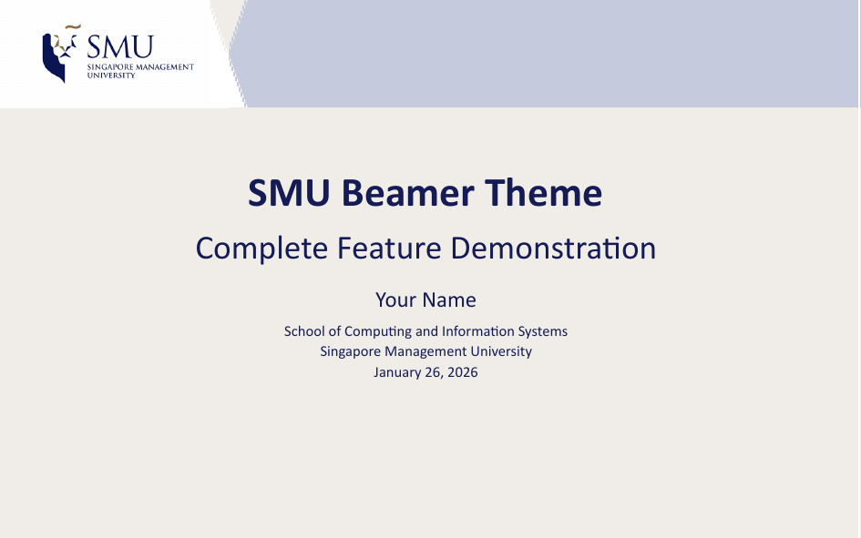
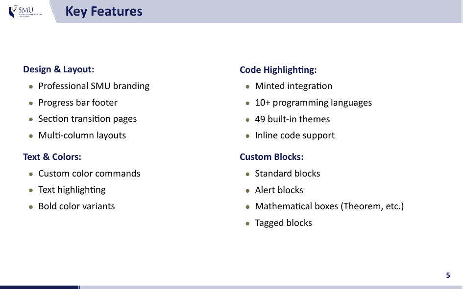
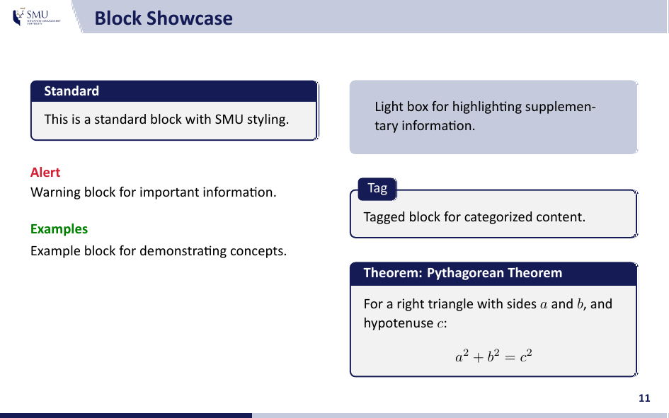
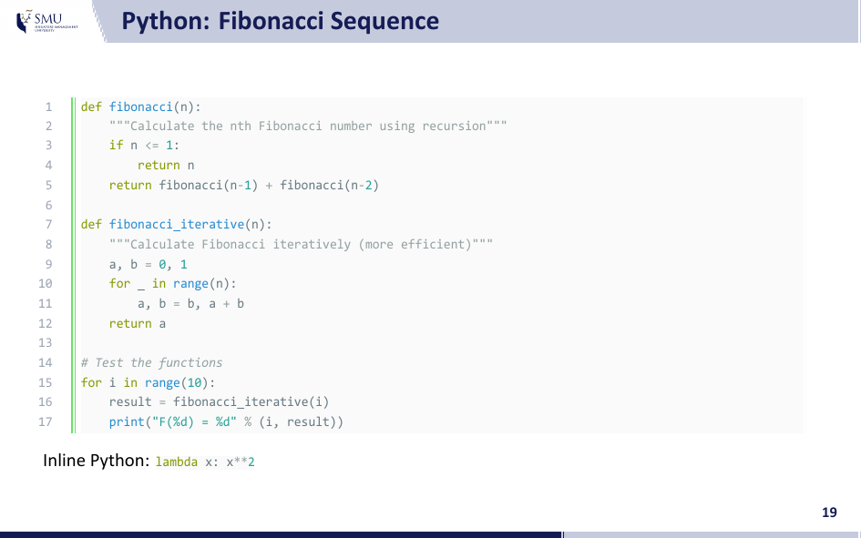

# SMU Beamer Theme (Light)

> **Light version**: 
>
> - The `minted` for code highlighting has been removed. 
> - *No Python/Pygments required, faster compilation*.
> - For code blocks highlighting support, use the [`main`](https://github.com/Jiangjiang-jiang/smu-beamer-template/tree/main) branch.

This is an unofficial Beamer presentation template for Singapore Management University (SMU).
It is designed for postgraduate academic presentations, including seminars, defenses, and talks.

- **Author:** qsang

- **Contact:** qsangxin@gmail.com

Screenshots are follows and here is a full [demo](./main.pdf) (without code rendering).

|           Title Page            |           Key Features           |
| :-----------------------------: | :------------------------------: |
|  |  |
|     **Blocks & Components**     |     **Syntax Highlighting**      |
|     |          |

## Compilation & Installation

This branch only requires a LaTeX distribution (MiKTeX or TeX Live).

```bash
git clone -b feature-smu-beamer-template-light https://github.com/Jiangjiang-jiang/smu-beamer-template.git
cd smu-beamer-template
```

### Using Scripts

The project includes build scripts under the `scripts/` directory:

```bash
# Windows
.\scripts\compile.bat
.\scripts\clean.bat

# Linux / macOS
./scripts/compile.sh
./scripts/clean.sh
```

`main.pdf` is under the dictionary `output/`.

### Manual Compilation

```bash
xelatex -output-directory=output main.tex
biber output/main
xelatex -output-directory=output main.tex
xelatex -output-directory=output main.tex
```

### Overleaf

To use this template on Overleaf:
1. Upload the project as a `.zip` file.
2. Set the Compiler to `XeLaTeX` in the project settings.

### Quick Start

Include the theme in your LaTeX preamble:

```latex
\documentclass[10pt,aspectratio=1610]{beamer}

\usepackage{smu}

\title{Presentation Title}
\author{Your Name}
\institute[SMU]{School of Computing and Information Systems}
\date{\today}

\begin{document}

\maketitle

\begin{frame}{Introduction}
    Your content goes here.
\end{frame}

\backmatter

\end{document}
```

## Project Structure

This theme is designed to be highly customizable. The tree of files is:

```text
smu-beamer-template/
├── main.tex
├── ref.bib
├── .gitignore
│
├── scripts/             # Build scripts
│   ├── compile.bat
│   ├── compile.sh
│   ├── clean.bat
│   └── clean.sh
│
├── smu.sty              # Theme package file
│
├── smucore/             # Theme modules
│   ├── smucolors.def    # Color setting
│   ├── smufonts.def     # Font setting
│   ├── smucommands.def  # Custom commands
│   ├── smublocks.def    # Blocks
│   └── smutemplates.def # Page templates
│
├── fonts/               # Custom fonts (Calibri, Consolas)
│
├── source/              # Theme assets
│   ├── smu_header_large_left.png
│   └── smu_header_small_left.png
│
└── output/              # Build output (auto-generated)
    ├── main.pdf         # Final PDF
    └── ...
```

## Usage Guide

### Sections and Frames

```latex
\section{Section Title}

\begin{frame}{Frame Title}
    Frame content
\end{frame}
```

Section pages are automatically generated. To disable section pages, do not use `\section{}` command in your slides or comment out the following line in `smucore/smutemplates.def`:

```latex
\AtBeginSection[]{\smusectionpage}
```

### Block Environments

```latex
% Standard Block
\begin{block}{Title}
    Content
\end{block}

% Light Box
\begin{lightbox}
    Highlighted information
\end{lightbox}

% Alert Block
\begin{alertblock}{Warning}
    Important notice
\end{alertblock}

% Theorem Box
\begin{theorem}[Optional Name]
    Theorem statement
\end{theorem}

% Tag Block
\begin{tagblock}{Tag Label}
    Content with labeled tag
\end{tagblock}
```

### Multi-Column Layouts

**Two Columns:**

```latex
\begin{twocolumns}
    \leftcol{
        Left column content
    }
    \rightcol{
        Right column content
    }
\end{twocolumns}
```

**Three Columns:**

```latex
\begin{threecolumns}
    \leftcol[0.3]{
        Left column
    }
    \midcol[0.3]{
        Middle column
    }
    \rightcol[0.3]{
        Right column
    }
\end{threecolumns}
```

Column widths are customizable using optional parameters (default: 0.48 for two columns, 0.31 for three).

### Text Formatting

```latex
% Colored Bold Text
\textbf{text}      % Blue bold (SMU blue)
\redbf{text}       % Red bold
\bluebf{text}      % Muted blue bold

% Inline Code Style (no syntax highlighting)
\smucode{value}    % Monospace styled text

% Highlighted Text
\shadedtext{text}                    % Blue background
\shadedtext[red]{text}               % Custom color background
\shadedmathbox{x^2 + y^2}            % Math with background
```

## Disclaimer

This is an unofficial theme and is not affiliated with or endorsed by Singapore Management University (SMU). The project is provided "as is," and users are responsible for ensuring compliance with SMU's official brand guidelines and academic integrity policies.
